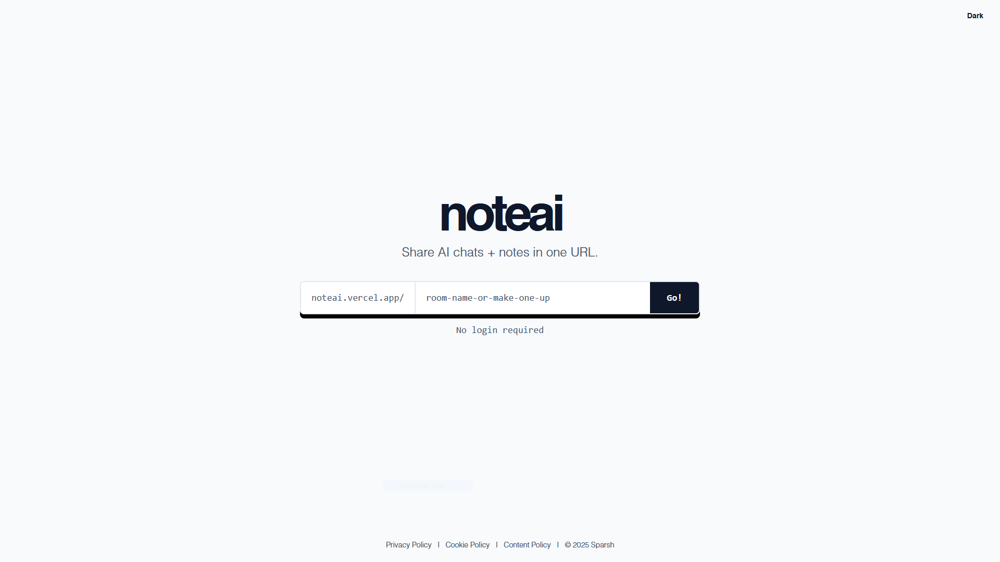

# noteai — AI chat + notes

A minimal, URL-based collaborative pad with AI context awareness. Inspired by Dontpad, powered by Gemini, built for instant sharing—no logins.



## Run locally

Prereqs: Node.js, a Google Gemini API key.

1) Install deps  
```bash
npm install
```
2) Create `.env` in the repo root and add:  
```
VITE_API_KEY=your_gemini_api_key
```
3) Start dev  
```bash
npm run dev
```

## Deploy to Vercel

1) Push this repo to GitHub (e.g., origin `https://github.com/sparshb4tra/dpkiller.git`).  
2) In Vercel: **New Project** → import the repo.  
3) Set Environment Variable: `VITE_API_KEY` = your Gemini key.  
4) Build command: `npm run build` (output: `dist`).  
5) Deploy. Preview/social image is served from `/site-preview.PNG`.
